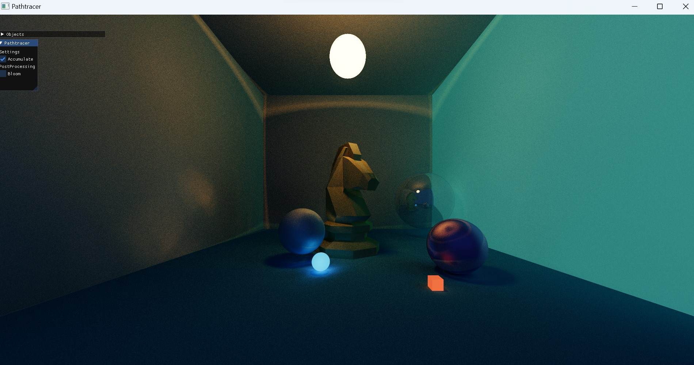

# Pathtracer

A personal project with the aim of creating a GPU Accelerated Pathtracer using OpenGL

## Features

- Diffuse Rendering
- Specular Rendering
- Transmission and Refraction
- Polygons (Ray-Triangle Intersection)
- GPU Accelerated

## How it developed

First it started with some simple Ray-Sphere Intersections and Basic Diffuse Lighting in Shadertoy

Raytracing without Accumulation, Dot Product Diffuse Lighting

Accumulation Without Tone Mapping
 

Specular Reflections

Diffuse Light Bounces

---

Then I moved it to OpenGL, allowing much more advanced calculations, performance and controll

Sky and Ambient Light

Ray-Triangle Intersection, Polygons

Bloom

Transmission and Refraction, ImGUI

---

At last, there is a more composed scene viewed in many ways

Scene without Bloom

Scene with Bloom

Scene without Bloom with Blender Denoise and Glare applied

Scene with Bloom and Blender Denoise

## The Future

I consider the results as satisfactory, there are still some features missing such as caustics, proper light transmission/refraction and Skybox, but the main objective has been achieved for now

## What I've Learned

- The Rendering Equation
- PBR
- Shader programming skills
- Understanding of how a modern renderer work
- Light interactions with objects and nature

## Resources

 - [Sebastian Lague Code Adventure](https://www.youtube.com/watch?v=Qz0KTGYJtUk)
 - [The Cherno Series](https://www.youtube.com/playlist?list=PLlrATfBNZ98edc5GshdBtREv5asFW3yXl)
 - [Eduard0110 OpenGL Pathtracer](https://github.com/Eduard0110/Path-tracer-using-OpenGL)
 - [Shadertoy Pathtracer Series](https://blog.demofox.org/2020/05/25/casual-shadertoy-path-tracing-1-basic-camera-diffuse-emissive/)
